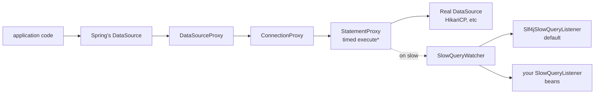

# slow-query-watcher

> A Spring Boot 3 starter that auto-logs slow JDBC queries with full context —
> drop the dependency, set a threshold, get one structured log line per slow
> query with the SQL, parameters, caller stack trace, and active transaction.

[](https://github.com/lucasfrederico/slow-query-watcher/actions/workflows/ci.yml)
[](LICENSE)
[](https://openjdk.org/projects/jdk/17/)
[](https://spring.io/projects/spring-boot)
[](https://jitpack.io/#lucasfrederico/slow-query-watcher)

## Why?

Every Spring Boot service eventually needs "tell me which queries are slow in
production." The existing answers are all uncomfortable:

- **`org.hibernate.SQL` debug log** is Hibernate-only, has no parameters in
  production (`hibernate.format_sql=true` shows `?`), and floods the logs with
  every query, fast or slow.
- **`p6spy`** is mature but JDBC-only — no Spring Boot starter, XML-driven
  config, last release in 2018, surprises around `spy.properties` discovery.
- **`datasource-proxy`** is the right primitive but you wire it yourself: a
  `BeanPostProcessor`, a `ProxyDataSourceBuilder`, listener registration. Easy
  to get wrong, easy to forget, easy to drop when migrating across Spring Boot
  majors.
- **Database-side slow query logs** (`pg_stat_statements`, MySQL slow log) tell
  you which query is slow, but not which line of your application issued it.

`slow-query-watcher` is the missing 90% — auto-config wraps every `DataSource`
bean, the threshold is one property, and a slow query produces a structured
SLF4J line with the SQL, the parameter values (or redacted positions, your
choice), the duration in milliseconds, the active transaction name, and the
exact application frame that issued the call.

## Quickstart

**1.** Add the dependency (JitPack — Maven Central in flight):

```xml
<repositories>
    <repository>
        <id>jitpack.io</id>
        <url>https://jitpack.io</url>
    </repository>
</repositories>

<dependency>
    <groupId>com.github.lucasfrederico.slow-query-watcher</groupId>
    <artifactId>slow-query-watcher-spring-boot-starter</artifactId>
    <version>v0.1.1</version>
</dependency>
```

**2.** Pick a threshold in `application.yml`:

```yaml
slow-query-watcher:
  threshold: 100ms
```

**3.** That's it. Every query slower than 100 ms now shows up in your logs:

```
WARN  slow-query-watcher - Slow query: 412 ms — SELECT count(*) FROM orders WHERE created_at > ?
      sql="SELECT count(*) FROM orders WHERE created_at > ?"
      duration_ms=412
      parameters=[2026-05-01]
      data_source=dataSource
      tx_id=OrderService.summary
      caller=com.acme.app.OrderService.summary(OrderService.java:48)
      trace_id=8e3477c4dec6415b
```

No code changes. Hibernate, MyBatis, raw `JdbcTemplate`, Spring Data — anything
that runs through a `javax.sql.DataSource` is covered.

## Configuration reference

```yaml
slow-query-watcher:
  enabled: true                    # master switch; default true
  threshold: 100ms                 # Duration; queries faster than this are silent
  log-level: WARN                  # TRACE | DEBUG | INFO | WARN | ERROR
  capture-stack-trace: true        # capture & report the caller frame
  stack-trace-max-frames: 32       # cap the trace length after internal frames are stripped
  capture-parameters: FULL         # FULL | REDACTED | NONE
  exclude-patterns:                # SQLs that match any of these are never reported
    - "^SELECT 1$"
    - "^SELECT version\\(\\)$"
```

| Property | Default | Notes |
|---|---|---|
| `enabled` | `true` | Set `false` to skip wrapping every `DataSource` bean. |
| `threshold` | `100ms` | Any [`Duration`](https://docs.spring.io/spring-framework/reference/core/validation/format.html#format-DurationFormat) Spring can parse: `500ms`, `2s`, `PT0.5S`. |
| `log-level` | `WARN` | Level used by the built-in SLF4J listener. |
| `capture-stack-trace` | `true` | Add ~5 µs per slow event. Internal `sqw` / JDK reflection frames are filtered out. |
| `stack-trace-max-frames` | `32` | After filtering, only this many frames are kept. |
| `capture-parameters` | `FULL` | `FULL` keeps every value, `REDACTED` replaces values with `"?"` (positions preserved), `NONE` reports `null`. |
| `exclude-patterns` | `[]` | Java regex; matched with `find()` so anchor with `^…$` for whole-string match. |

## Architecture



When a Spring Boot app starts, `SlowQueryWatcherAutoConfiguration` registers a
`BeanPostProcessor` that wraps every `DataSource` bean in a `DataSourceProxy`
before Hibernate, MyBatis, or `JdbcTemplate` ever sees it. The proxy is
implemented with `java.lang.reflect.Proxy` so the entire JDBC surface
(`Connection`, `Statement`, `PreparedStatement`, `CallableStatement`) delegates
to the real driver and intercepts only the `execute*` methods plus
`setXxx(int, …)` parameter binders.

Timing is `System.nanoTime()` around each `execute*` call. When the elapsed time
exceeds the configured threshold and the SQL doesn't match an exclude pattern,
the watcher builds a `SlowQueryEvent` and dispatches it to every registered
`SlowQueryListener` bean. A `SlowQueryListener` that throws is logged at `WARN`
and does not block other listeners.

## Custom listeners

Drop a bean implementing `SlowQueryListener` and you get every event:

```java
@Component
public class MicrometerSlowQueryListener implements SlowQueryListener {
    private final Timer timer;

    public MicrometerSlowQueryListener(MeterRegistry registry) {
        this.timer = Timer.builder("db.query.slow")
                .description("queries above the slow-query-watcher threshold")
                .register(registry);
    }

    @Override
    public void onSlowQuery(SlowQueryEvent event) {
        timer.record(event.durationMs(), TimeUnit.MILLISECONDS);
    }
}
```

The default `Slf4jSlowQueryListener` stays registered; your listener runs in
addition to it. Disable the default by setting `slow-query-watcher.log-level`
on a logger filter, or by providing your own `SlowQueryListener` bean and
marking it `@Primary` if you want to silence the SLF4J one (define a no-op
`Slf4jSlowQueryListener` in that case).

## Comparison vs alternatives

| | slow-query-watcher | p6spy | datasource-proxy | Hibernate `org.hibernate.SQL` |
|---|---|---|---|---|
| Spring Boot 3 starter | ✓ | ✗ | ✗ | (built-in) |
| Threshold-based filtering | ✓ | manual | manual | ✗ (logs everything) |
| Parameter capture | full / redacted / none | yes | yes | only in debug mode |
| Caller stack trace | ✓ filtered | ✗ | ✗ | ✗ |
| Active transaction id | ✓ Spring-aware | ✗ | ✗ | ✗ |
| Pluggable listeners | ✓ (Spring beans) | yes (XML) | yes (Java) | log appender only |
| Modern Java (records, `Duration`) | ✓ | ✗ | partial | n/a |
| Maintenance | active 2026 | last release 2018 | active | (part of Hibernate) |

## How the proxy chain works

The whole chain is one decorator at each JDBC layer:

```
javax.sql.DataSource
    └─ DataSourceProxy.getConnection()
        └─ ConnectionInvocationHandler  ← java.lang.reflect.Proxy
            ├─ on createStatement()      → wraps Statement
            ├─ on prepareStatement(sql)  → wraps PreparedStatement (binds sql)
            └─ on prepareCall(sql)       → wraps CallableStatement (binds sql)
                └─ StatementInvocationHandler  ← java.lang.reflect.Proxy
                    ├─ on setXxx(int idx, value)  → snapshots parameter binding
                    ├─ on clearParameters()       → drops snapshot
                    ├─ on addBatch* / clearBatch  → tracks batch count
                    └─ on execute* / executeQuery* / executeUpdate* / executeBatch*
                        └─ System.nanoTime() around the call
                            └─ SlowQueryWatcher.onExecution(sql, params, duration)
                                ├─ apply threshold
                                ├─ apply exclude patterns
                                ├─ build SlowQueryEvent
                                └─ fan out to every SlowQueryListener
```

Anything not in the intercept list is forwarded verbatim. There is no special
handling for `ResultSet`; row iteration cost is not part of the measured query
time (just the execution call itself).

## When NOT to use this

- You need *exact* query timing including row fetch and network read-back —
  this measures only the `execute*` call. Use database-side slow logs
  (`log_min_duration_statement`, MySQL `slow_query_log`) when you need
  driver-to-fetch-to-close coverage.
- You need an audit trail of *every* query (fast or slow) — this is a threshold
  tool, not a tracer. Use OpenTelemetry JDBC instrumentation for full traces.
- Your data source is reactive R2DBC — this is JDBC only. R2DBC support is
  planned for v0.2.0.

## Roadmap

- **v0.2.0** — Postgres `EXPLAIN` plan capture for slow queries, Micrometer
  metrics (counter + histogram), sampling (1-in-N to cap volume under sustained
  slow load), an `/actuator/slow-queries` endpoint.
- **v0.3.0** — R2DBC reactive support, `HikariDataSource`-aware wrapping
  (capture pool wait time alongside query time), MyBatis interceptor parity.

## Build & test

```bash
# Unit tests only (fast, no Docker required)
./mvnw -pl slow-query-watcher-core -am test

# Full verify with Testcontainers Postgres + MySQL (Docker required)
./mvnw verify
```

The CI matrix runs Java 17 and 21 on Linux against both Postgres 16 and MySQL
8.4 via Testcontainers.

## License

MIT — see [LICENSE](LICENSE).
